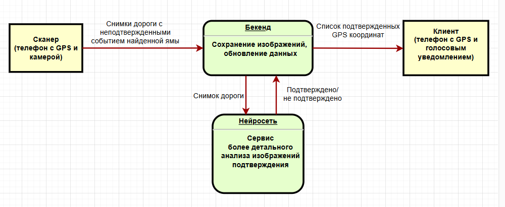
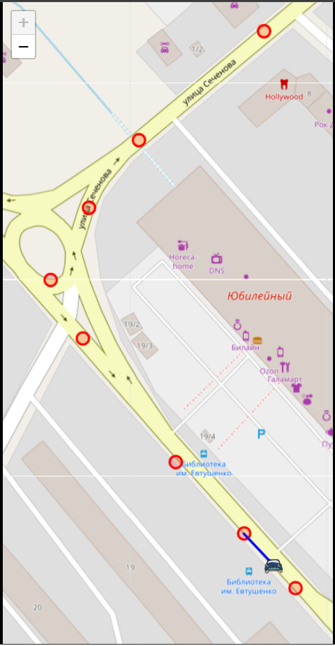
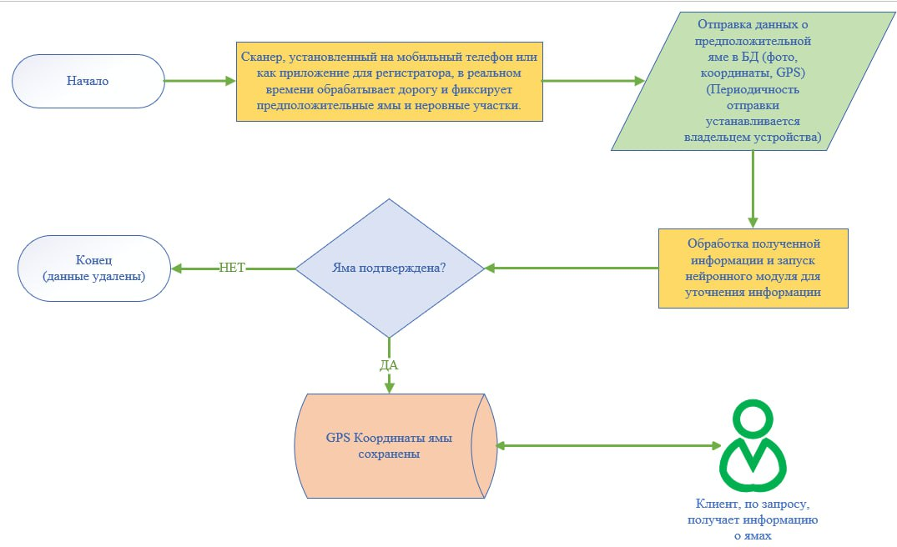
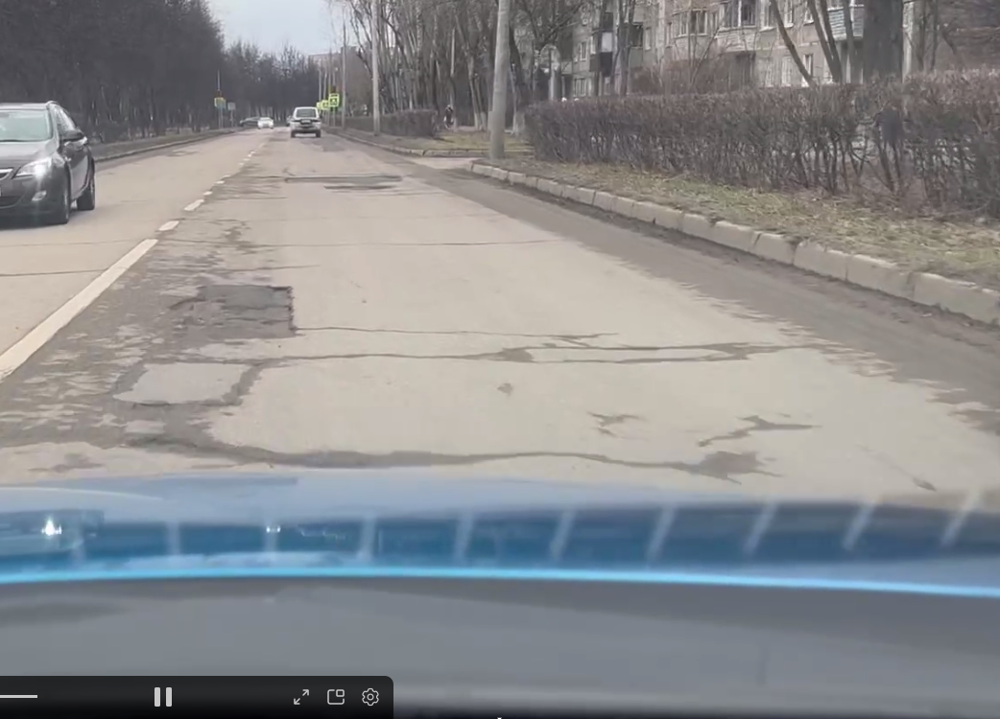

## АнтиЯма
Приложение по поведению похожее на антирадар

Только в нашем случае приложение предупреждает о яме на дороге.
Может показаться что их и так видно, но если водитель едет в незнакомой местности 
в сумерках и в непогоду, то разглядеть яму бывает очень сложно.

Эта система может работать как отдельно, так и в паре с навигатором.
### Необходимые компоненты

- Python 3.9+ - https://www.python.org/downloads/
- Node.js - https://nodejs.org/en/download/

### Составные части
- **Сканер** - это телефон на базе андроида, который может использоваться как видеорегистратор и параллельно выполнять сканирование
дорожного полотна. 
  - В телефоне работает легковесный алгоритм без нейросетей, оптимизированный на скорость работы
  - При нахождении ямы, сканер сохраняет изображение и GPS координаты. В конце дня или сразу
    (если позволяет тариф на телефоне) происходит отправка данных на сервер
- **Бекенд** - сервер на Python, FastAPI, PostgreSQL. доступен по адресу http://176.119.158.23:8001/docs 
является связующим звеном, аккумулирует данные.
- **Нейросеть** - сервис, заточенный на более глубокий анализ изображений. Перепроверяет изображения
после сканера на предмет ложных срабатываний
- **Клиент** - конечный пользователь системы. Сгружает раз в сутки список GPS-координат и в процессе езды
предупреждает о приближающейся ямы



### Структура репозитория
- /scanner - для демонстрации процесса сканирования надо зайти в эту директорию и выполнить команды
  - pip install -r requirements.txt
  - python main.py **Делать это нужно не в collab или jupiter lab, так как будет воспроизведено потоковое видео для
демонстрации потоковой обработки** Для выхода надо нажать Esc, для замедления Space
- /server - запущен по адресу http://176.119.158.23:8001 и готов принимать запросы
- /Service - служба с нейросетью, котоаря выгружает потенциально найденные ямы и подтверждает / либо
не подтверждает их наличие
- /client - эмуляция мобильного приложения


### Activity Diagram


### Тестирование проекта
Все модули учебного проекта выполнены на python за исключением клиента.
Если бы это был реальный продуктовый, то сканер и клиент могли быработать совместно в рамках
одного приложения на одном телефоне Android + onpencv https://opencv.org/android/ и писать пришлось бы на Java

1. запуск сервера (на время хакатона уже запущен и доступен по публичному адресу)
```aiignore
cd server
python -m venv .venv
source .venv/bin/activate
pip install -r requirements.txt
python -m uvicorn app.main:app 
```
2. сканирование тестового видеофайла из директории /scanner/resources/test_video.mp4
```aiignore
cd scanner
python -m venv .venv
source .venv/bin/activate
pip install -r requirements.txt
python main.py
```
3. подтверждение найденных изображений нейросетью
```aiignore
cd Service
python -m venv .venv
source .venv/bin/activate
pip install -r requirements.txt
python main.py
```
4. запуск клиента - проверка звукового оповещения
```aiignore
cd client
npm install
npm run dev
```

### Выводы
- задача вполне реализуема, но вряд-ли в реальных продуктовых системах может работать отдельно
Возможно как составная часть видеорегистратора с wi-fi
- нейронные сети, найденные в открытом доступе плохо находят ямы
- отдельная задача - нахождение разметки, машин людей и т.д. для минимизации ложных срабатываний
- задача усложняется на полупросохшей дороге: темный мокрый асфальт сложно отличить от ямы
Ниже пример. Слева асфальт не лучшего качества, но это все же не яма в начале. 
Если к видеорегистратору прикрутить гироскоп, то по поведению водителя и подвески авто 
можно будет достаточно точно определить что это все-же была яма
